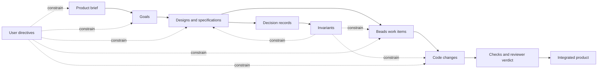

# Yoyodyne V1 Harness Design

## Status

This document records the agreed v1 design and the implementation sequence for reaching self-hosting early. Beads issue `yoyodyne-fmk` tracks completion of this design. Epic `yoyodyne-ifd` and its dependent milestone issues track implementation, which belongs in Beads rather than a Markdown task list.

The most recent implementation of this system is described here: https://github.com/mason-bryant/yoyodyne

## Summary

Yoyodyne is a local, single-operator harness that coordinates configurable AI agent roles to turn a product brief into goals, designs, implementation work, reviewed changes, and an integrated codebase. It aims to run development nearly autonomously: the human's routine interface is the product manager agent, and directing any other agent is an override rather than part of the loop. Claude Code is the default execution backend. Codex is a thinner optional backend for developer and reviewer agents. The managed project may be written in any language; Yoyodyne's own implementation language is not imposed on it.

V1 supports one product and one Git repository at a time. Its identifiers, configuration, and storage boundaries must allow later support for multiple products, repositories, and remote workers without changing the core domain model.

The implementation is deliberately sequenced around a narrow walking skeleton. Once Yoyodyne can take one Beads task, run one developer in an isolated worktree, execute deterministic checks, and preserve the result, that partial harness will be used to build later milestones. Automatic review and integration complete the self-hosting loop before the product-management hierarchy and concurrency are filled out.

## Goals and Non-goals

The goals this design serves, and the non-goals that bound it, are product intent rather than design, so they live with the product manager's artifacts rather than here: [the v1 goals](../product/goals/v1-goals.md) and [the v1 non-goals](../product/goals/v1-non-goals.md). They were moved out of this document unchanged, because [artifact ownership](#artifact-ownership) assigns the goals to the product manager, and intent stated in an architect-owned document is intent the owning role does not hold.

Invariant 1 below is what binds this design back to them: every design and implementation item must trace to at least one active goal.

## Design Invariants

1. Every design and implementation item must trace to at least one active goal; every active goal must support the product brief.
2. Upstream artifact ownership is enforced. Non-owners may propose changes, but cannot directly revise upstream intent.
3. A user directive applies regardless of which agent received it and remains discoverable until superseded or retired.
4. Ambiguous user intent pauses affected work until the product manager obtains clarification.
5. Artifact-changing directives pause affected work until the canonical artifacts and derived work are reconciled.
6. Developers only work in harness-created, validated worktrees; they never share a writable checkout.
7. Integration requires configured deterministic checks and an independent reviewer verdict. Routine human merge approval is not required.
8. Agent processes are ephemeral. Logical identities, decisions, assignments, sessions, and outcomes are durable.
9. The harness owns orchestration state transitions. Model output may recommend a transition but cannot bypass its preconditions.
10. All provider-specific behavior stays behind a capability-aware backend boundary.
11. The harness assumes no language, build system, or test framework in the managed project. Verification is the commands the project declares, run in the worktree; the harness decides only whether they passed.

## Product and Artifact Model

The canonical intent graph is:



Each canonical Markdown artifact has a stable ID and machine-readable metadata; [the artifact contract](artifact-contract.md) is the normative statement of the schema and shape. The exact schema may evolve, but it must identify:

- artifact ID and type;
- owning role;
- lifecycle status;
- upstream artifacts it supports;
- revision or content hash used to derive downstream work;
- approval state when approval is configured.

The harness validates references and reports orphaned goals, designs, and work. It does not infer that an unlinked artifact is acceptable merely because its prose appears related.

### Artifact ownership

| Artifact or state | Owner | Other roles may |
|---|---|---|
| Product brief and goals | Product manager | Ask questions and propose amendments |
| Designs and specifications | Architect | Identify risks, ask questions, and propose amendments |
| Decision records and the invariants extracted from them | Architect | Propose a decision, ask for an invariant, and report one a change would violate |
| Development plans and task decomposition | Development manager | Report dependencies, blockers, and side effects |
| Assigned code change | Developer | Modify code within the assigned worktree and task scope |
| Review verdict | Reviewer | Request repairs or approve against the design and checks |
| Workflow state, worktrees, checks, integration, and publishing | Harness | Agents may request actions but cannot bypass policy |

Ownership is an authorization boundary, not merely a prompt convention. A developer discovering a design problem creates a proposal or question for the architect; it does not edit the design and continue as if the change were approved. For a developer's worktree that boundary is enforced deterministically rather than asked for: its diff is refused on the artifact homes before review, as [what is enforced, and what is not](#what-is-enforced-and-what-is-not) records.

Two rows are worth reading deliberately. The architect's decision home is *additional* to designs rather than a move: designs and specifications stay with the architect, and the decision record is where the reasoning that produced one is kept after the design itself has moved on. The development manager, by contrast, owns no repository document at all. Its decomposition is the Beads work — items, dependencies, and acceptance criteria — so "development plans" names state in the tracker rather than Markdown in the repository, and the harness enforces that ownership over work items instead of over files.

### Decision records and invariants

A decision record and an invariant are complementary rather than two names for the same artifact, and the architect owns both.

A **decision record** — an ADR, in the usual naming — is the durable history of one decision: what was chosen, what was rejected, and what forced the choice. It is written once and afterwards only gains a status — accepted, superseded by a later record, retired. It is not edited to stay current, because a record revised to match today's system stops recording the decision anybody actually made.

An **invariant** is the live constraint extracted from such a decision: what must still hold, stated tightly enough that a developer can be held to it and a reviewer can find a violation. It is amended and retired as the system changes, and the set of active invariants is the answer to what currently holds.

Using either as the other fails predictably. Edit decision records to keep them current and the decision history rots away; leave the live constraints buried in historical prose and nothing can say which of them still apply. Recording a decision is also not sufficient on its own: an invariant nobody puts in front of a developer constrains nothing, so delivering the relevant ones into the developer's context and the reviewer's evidence is what turns a written constraint into an enforced one.

The [Design Invariants](#design-invariants) above are this document's own instance of the second kind — constraints extracted from the decisions that produced this design and stated so they can be enforced rather than rediscovered.

## Agent Model

An agent definition separates four concerns:

- **Role:** responsibilities, authority, inputs, expected outputs, and escalation behavior.
- **Identity:** a stable logical instance with assignments and durable history.
- **Backend:** Claude Code or Codex execution mechanics.
- **Policy:** model selection, permissions, timeouts, retries, and resource limits.

The local Claude Code or Codex process is not the agent's durable identity. Each execution receives a context bundle reconstructed from canonical artifacts, active directives, the assigned Beads item, relevant decisions, and any resumable provider session. This bounds stale conversational memory and prepares the domain model for remote workers later.

### Default roles

#### Product manager

- Owns the product brief and goals.
- Conducts most interaction with the user through an interactive CLI chat.
- Ensures every goal supports the brief and is specific enough to design against.
- Records directives received by any agent and coordinates reconciliation.
- Requests clarification when intent is ambiguous; affected work remains paused.

#### Architect

- Translates goals into designs and specifications.
- Maintains traceability from each design to its supporting goals.
- Defines boundaries and compatibility expectations so parallel specifications can be implemented safely.
- Records the decisions behind those designs, and creates, amends, and retires the invariants extracted from them.
- Evaluates downstream discoveries and owns resulting design amendments.

#### Development manager

- Converts approved designs into Beads work with dependencies and acceptance criteria.
- Considers side effects and integration order.
- Assigns work to developers and manages retries, replanning, and reassignment.
- May fetch additional product or design detail rather than receiving the entire product history in every prompt.

#### Developer

- Receives a bounded work item, relevant design, directives, and manager guidance.
- Works only in the assigned worktree.
- Runs local checks and returns structured results, questions, and discovered risks.
- Proposes upstream changes instead of making them directly.

#### Reviewer

- Is independent of the developer execution that produced the change.
- Reviews the diff against the work item, design, directives, and configured checks.
- Returns a structured approve-or-repair verdict with actionable findings.
- Does not integrate the change directly.

The set of roles is fixed in the harness. What a project configures is which agents fill those roles, how many, and each one's backend, model selector, and persona. Role authority and which tools each role may use — including the reviewer running with no tools — are derived from the role in code and are not configurable: authority a project could declare is authority a project could widen, and the ownership model rests on it. Adding or redefining a role is a change to the harness, not to a configuration file. Role and backend combinations are validated against the effective configuration before work is claimed, and an unknown role name must be refused at load. The `Capabilities` negotiation in the backend boundary is untouched by this: what a backend can do is a genuinely varying fact.

### Management and supervision

The management roles coordinate through the contract [management-and-supervision](management-and-supervision.md) records: persisted, typed requests the harness delivers by invoking the target role itself, under lease, bounded by cycle, cost, deadline, and deduplication. Its binding rules, stated here because they govern the agent model whole: the harness is the only component that invokes a role or execution agent; requests and responses are persisted and attributable, and a request is complete only when durable state records its outcome; product, architecture, and delivery authority remain distinct even when roles share a conversation; no user interface, Slack process, or model-provider session owns private workflow truth; and every mutation validates against current durable state, committing atomically or rejecting as stale.

Process residency belongs to the same contract. What runs today: run processes, conversation-holding chat processes, the Slack sink under the product manager's supervision, and the dashboard command. The conversation lease — per agent, single holder — is the reattachment primitive, and its single-holder rule is load-bearing wherever two clients could reach one agent. The full residency rules, the interim chat-spawned shape, and the headless service it is on the way to are the management-and-supervision design's to state.

## User Interaction, Directives, and Approval

V1 provides an interactive CLI conversation with the product manager plus one-shot administrative commands for status, inspection, directives, and agent interaction. The conversation with the product manager is the intended routine interface: stating intent, approving the brief and goals, and answering escalated questions should be the whole of normal operation. The user may also address any other agent directly, but that is an inspection, recovery, and override path rather than part of the loop. A directive received by a lower-level agent is still globally enforceable within its scope.

A directive record contains at least:

- stable ID, text, author, timestamp, and scope;
- receiving agent and acknowledgement state;
- affected products, goals, designs, tasks, agents, or files when known;
- whether it changes canonical artifacts;
- reconciliation status and links to superseding directives.

Operational directives take effect immediately. A directive that changes the brief, a goal, or a design pauses affected downstream work, routes reconciliation to the owning role, and resumes only after the canonical chain is consistent. If the directive is ambiguous, the product manager asks the user and work remains paused.

Staleness is derived rather than marked. What a change upstream leaves unanswered downstream is computed from the artifacts' own revision logs and the tracker's admission times and reported by `yoyo stale`; it stops, closes, blocks and reorders nothing, and it reads a hand edit exactly as it reads an amendment made through the harness. There is no stored flag: an artifact stops being reported when its owner records a later revision, and a work item stops when it closes. Anything that would clear staleness by other means is building a second account of it that can disagree with the documents.

The boundary is deliberate: a directive pauses work, and an artifact edited directly pauses nothing. A harness that paused the queue on every edit to a goal's wording would teach an operator not to edit, and the derived staleness report is what covers the gap.

The operator's control over work the harness chose for itself is three separate actions, deliberately not one: stop a single run; hold intake, so nothing more is selected while work already running finishes; and stop everything, which holds intake first and then stops each run in flight — the order is load-bearing, because holding first is what stops it becoming a race against the next selection. An operator-named item is not subject to the hold; naming it is the operator deciding it is the exception. A stop that crosses a process boundary is a cooperative request, written beside the run and honored at the stopping process's next provider-call boundary, not a kill: a generation already streaming is paid for, killing it costs the work again, and a run that has not given up within the grace is reported as still in flight rather than described as stopped. The harness stops a provider invocation itself only for a stall or an exhausted budget — the one asymmetry with operator stops. Every run records why its item was selected, in durable run state, and the absence of a reason is reported as such rather than rendered as a missing line: a run nothing accounts for is indistinguishable from work happening behind the operator's back.

By default, the human explicitly approves the initial brief and goals after discussing them with the product manager. Lower-level approval gates are configurable but disabled by default. This approval policy does not add a routine human merge gate: once a project enables automatic integration, verified and independently approved code is integrated without further human action, which is what makes near-autonomous operation possible.

The shipped bundle nevertheless defaults `approvals.integration` to `human`. That is deliberate and is not a retreat from the autonomy goal: a project opts in to automatic integration explicitly, and the harness then refuses that setting unless deterministic checks and an independent reviewer actually exist. Autonomy is something a project turns on once it has the gates to justify it, rather than something inherited silently by any repository that adds a configuration file.

`approvals.publishing` defaults to `human` for the same reason and a stronger one: pushing a branch and opening a pull request is visible outside the machine the harness runs on, so it is opted in to rather than inherited. It is a separate approval from integration because it has a wider blast radius, not because it adds a human gate of its own: a project that enables both publishes, merges, and cleans up without further human action. The two approvals compose rather than imply one another, and [the Git model](#git-model) sets out what each combination produces and what stays authoritative.

## Persistence Boundaries

### Repository Markdown

Human-readable product intent lives with the product repository. A recommended initial layout is:

```text
docs/
  product/
    brief.md
    goals/
  designs/
  specifications/
  decisions/
    invariants/
.yoyodyne/
  config.yaml
  personas/
```

These files are reviewable with the code and are the source of truth for their content. Beads records their workflow state and relationships but does not replace them with issue descriptions.

`decisions/` is the architect's decision home: one file per decision record, with the invariants extracted from them in `invariants/` beneath it, kept in their own directory because [the two have different lifecycles](#decision-records-and-invariants). It sits next to `designs/` rather than replacing it, and the development manager has no counterpart directory because its output is Beads work rather than Markdown.

One word does double duty across this layout, and the two senses are worth separating. The `specifications/` directory above holds the architect's specifications — the detailed form of a design, which [artifact ownership](#artifact-ownership) assigns to the architect in the same row as designs. The `product.specifications` *setting* is a different thing that happens to share the word: it names the single directory the product manager reads product intent from, which is `docs/product` by default. The shared store assembly reads three artifact homes — `docs/product` (this `product.specifications` setting), `docs/designs`, and `docs/decisions`, with the invariants directory excluded and read by `yoyo invariant` instead — one assembly shared by the commands and the repository tests. The architect's `specifications/` directory in the layout above is not among them. The layout block shows more than the store reads: `.yoyodyne/config.yaml` and `.yoyodyne/personas/` are read by configuration discovery and persona loading, which is why the count here is of artifact homes rather than of directories. [Configuration](../configuration.md#product-specifications) is the reference for it.

Everything under `.yoyodyne/` is machine-independent and belongs in version control. A single `.yoyodyne.yaml` file at the repository root is still accepted so an existing project keeps working without being migrated; when both exist in one directory, the directory form wins.

### Beads

Beads is a required v1 dependency and the durable source of truth for:

- work items, status, dependencies, blockers, and assignments;
- directive records and reconciliation work;
- approval records and durable questions;
- links from work to canonical artifact IDs and revisions;
- retry, handoff, and discovered follow-up work.

The harness uses the `bd` CLI through a narrow adapter in v1. Domain code must not depend on raw command output outside that adapter, leaving room for a different Beads integration mechanism later.

### Runtime state

Provider event streams, process metadata, locks, caches, and temporary run state live outside the product repository under an operating-system-appropriate state directory. Durable outcomes are summarized into Beads. Worktrees also live outside the primary checkout by default. Secrets and provider credentials remain managed by the provider CLIs — including the forge CLI publishing uses — and are never copied into Beads, into project Markdown, or into an agent's prompt or context bundle. That is a statement about what the harness puts in front of an agent; it is not a claim that the credentials are unreachable from a process the harness started. See [what the Git model enforces](#what-is-enforced-and-what-is-not).

All durable records include `ProductID` and, where applicable, `RepositoryID`, even though v1 configures exactly one of each.

The durable run-state schema's closed vocabularies stay closed: a reader may rely on the recorded set. An addition to a producing vocabulary is a deliberate act held by a conformance test that forces every consumer to be updated together, rather than by a save-time refusal — which would make older binaries reject records newer binaries legitimately wrote.

## Backend Boundary

The harness uses coding-agent CLIs as subprocess backends. A conceptual Go interface is:

```go
type AgentBackend interface {
	CheckAvailability(ctx context.Context, cfg BackendConfig) error
	Capabilities(ctx context.Context, cfg BackendConfig) (Capabilities, error)
	Start(ctx context.Context, req RunRequest) (Run, error)
	Resume(ctx context.Context, req ResumeRequest) (Run, error)
}
```

`RunRequest` contains the role instructions, context bundle, repository and worktree identity, permission policy, desired structured result, and correlation IDs. A run emits normalized events such as:

- run and turn started;
- agent message;
- tool or command started/completed;
- file change observed;
- usage reported;
- run completed, failed, cancelled, or timed out.

The harness persists the provider session ID when available, but does not assume all backends support identical resumption, event, tool-control, or usage features. `Capabilities` makes those differences explicit.

### Claude Code

Claude Code is the default backend for every v1 role. The adapter uses its non-interactive, structured-output mode and existing local authentication. The first walking skeleton only needs the developer path; manager and product-role prompting is added later.

### Codex

Codex remains designed and parked at priority 4 off the V1 critical path, per [claude-only-v1-execution](../decisions/claude-only-v1-execution.md); the adapter description below is the design it re-enters through. Codex is a thin optional v1 backend for developer and reviewer roles. Its adapter uses `codex exec`, JSONL events, resumable sessions when available, structured final output where useful, and explicit sandbox settings. Codex is not required to match every Claude Code feature. Unsupported role/backend or policy combinations fail validation before work is assigned.

Codex authentication is delegated to the locally installed CLI. It may use ChatGPT subscription authentication or an API key; the harness reports the active/missing state but never manages account credentials.

## Configuration

Agent definitions and behavior are configurable, while invariants — and role authority, which no configuration can grant or widen — remain enforced in code. The executable ships a versioned, read-only bundle of agent definitions and personas, so a project records only what is genuinely its own and never needs access to the Yoyodyne source checkout. A project inherits the bundle by name and overlays what it changes:

```yaml
version: 1
extends: builtin:v1

product:
  id: yoyodyne
  repository: .

approvals:
  integration: automatic

checks:
  - go test ./...
  - go vet ./...

agents:
  developer:
    model: claude-opus-5-20260514
  reviewer:
    persona:
      version: house-1
      path: personas/reviewer.md
```

That is a complete configuration. The five default agents — product manager, architect, development manager, developer, and reviewer — come from `builtin:v1` with a role, a backend, a model selector, an instance count, and a versioned persona each. Three layers produce the effective configuration, later ones winning: harness defaults, the named bundle, then the project file. A field a layer does not mention is inherited; a field it does mention replaces the inherited value, except that `checks` is replaced as a whole list rather than concatenated, and a `persona` override replaces the inherited persona completely rather than merging into it. Removing an inherited agent is explicit, so an agent is never lost by being accidentally omitted.

The `checks` above are this project's own, and they are the harness's only view of the managed project's toolchain. Each entry is a shell command run in the worktree; the harness decides whether it passed and nothing else. A TypeScript, Python, or Java project declares its own commands in exactly the same place, which is what keeps the harness language-agnostic without needing per-language support.

`version` is the one field a project never inherits: it must be declared even when `extends` names a bundle that declares its own, so a file written against a different schema fails rather than loading as whatever the bundle happened to say. A configuration with no `extends` key is a complete standalone file that inherits only the harness defaults; that is the pre-directory shape, and it still loads unchanged.

Personas specialize how an agent works and can never grant it authority: the immutable role contracts are enforced in Go and prefix the configured guidance in the prompt. A persona `path` is relative to the project `.yoyodyne` directory and must name a Markdown file inside it. Configuration loading rejects unknown keys, unknown bundles, unsafe or non-Markdown persona paths, unknown role capabilities, invalid ownership, unsupported provider combinations, and automatic integration without both checks and review. Validation runs against the effective configuration, so a combination no single layer expressed still fails before any work is claimed.

[Configuration](../configuration.md) is the operator-facing reference for the layout, precedence, merge semantics, and inspection commands.

## Work Execution and Integration

For each ready development item, the harness:

1. Validates that its design and goal references are current and that no applicable directive is unresolved.
2. Reserves the item and creates a uniquely named branch and worktree outside the primary checkout.
3. Builds the developer's bounded context and starts the selected backend.
4. Streams normalized events and persists enough state to diagnose or recover an interrupted run.
5. Publishes the attempt when the project enabled publishing: commits it, pushes the run branch, and opens or updates its pull request.
6. Runs configured deterministic checks in the worktree.
7. Runs an independent reviewer with the work item, design, directives, diff, and check results.
8. On repair, returns findings to the same developer for up to two attempts by default.
9. After the retry limit, returns control to the development manager to replan or reassign.
10. On success, revalidates the target branch, integrates automatically, publishes the promotion, records the outcome, and cleans up the worktree.

The harness performs Git lifecycle operations directly; agents do not create, assign, merge, or remove their own worktrees. Before any cleanup, the harness resolves and validates the exact recorded path and refuses broad or unresolved targets.

If integration encounters drift or conflicts, the change is not force-merged. The development manager receives a new reconciliation decision with the current target state. Failed or interrupted worktrees remain discoverable until safely resumed or explicitly retired.

## Git Model

Every Git write the harness makes is its own. An agent is asked to edit files and nothing else: no role is given a credential, a tool, or a request that would have it commit, push, or merge, and the harness routes none of those through one. Roles decide, the harness performs.

### What is enforced, and what is not

The distinction matters, because "the harness never asks an agent to do this" and "an agent cannot do this" are different claims and only some of them hold.

**Enforced in code.** A run's worktree may only be at the HEAD durable state recorded: the base commit it was created at, or the exact commit the harness itself made. Anything else fails the ownership check that review, integration, and publishing all go through, and the run stops there. That check is a comparison against a recorded hash rather than a judgement about what a commit looks like — a developer has a shell in its worktree and the harness's commit identity is a constant in this repository, so an imitated commit is easy to produce and worth nothing, because it is not the hash run state already named. The rest of the gate is enforced the same way: promotion requires passing checks, an approving verdict, two demonstrably independent provider invocations, and a fast-forward from the recorded base.

**Enforced for the reviewer specifically.** The reviewer runs with no tools at all — an empty tool list and a read-only permission mode — so the role whose verdict authorizes the merge has no way to perform one. That is what makes "the reviewer decides, the harness merges" a boundary rather than an arrangement.

**Enforced for the developer's diff.** A developer's diff that touches a configured artifact home — `docs/product`, `docs/designs`, or `docs/decisions`, as configured — or the project's `.yoyodyne` directory is refused deterministically, before any check runs and before any reviewer sees it, unless the work item's own text grants the path. This is the ownership boundary holding against an editor in a worktree, not only against writes through the artifact store: a developer that edits a document it does not own no longer depends on its contract or the reviewer to be caught, because the gate refuses the diff outright. The paragraph below is unchanged by this — it is about pushing and merging, and the gate grants no credential and removes none.

A grant is a marker line in the work item's own text, read from the title, the description, the design guidance, and the acceptance criteria — and never from the notes. That exclusion is a trust boundary rather than a formatting choice: the harness appends agent-authored run records to an item's notes, so a grant readable there would let a developer's own run summary grant its next attempt access to protected paths. A grant naming a directory covers its contents. A grant is written by whoever authors those fields — the operator, the product manager at admission, the development manager in decomposition — and it should name the decided change it exists to record: the approved amendment or operator decision whose recording is being delegated. The legitimate use of the exception is delegating the recording of an already-decided change, never delegating the deciding, so the reviewer is instructed that a grant with no decided change named behind it is a finding.

**Not enforced for the developer.** There is no equivalent for pushing or merging from the developer's side. A developer has a shell in its worktree, its process runs under the operator's account, and the forge CLI keeps its credentials there, so an agent that went looking could reach them; what stands in the way is the sandbox its backend applies and the harness contract in its prompt, not a boundary this design guarantees. Treat "no agent pushes" as a statement about what the harness does, not as an invariant it enforces.

What limits the damage is that the authoritative branch is the local one. Work an agent pushed by itself is not integrated by having been pushed, and a pull request an agent merged behind the harness's back moves the remote target away from the local one — which the harness's own remote-target check then refuses rather than force-resolves, reporting an outstanding publication for a person to look at. Closing the gap properly needs the backend boundary to scrub or withhold forge credentials for the developer role, which is deferred rather than done.

### Local branches

One run means one worktree outside the primary checkout and one branch created for it, from exactly the branch the work will be promoted into. That target is fixed before any work starts and recorded, so a resumed run promotes into the branch it was written against rather than whatever happens to be checked out later. Promotion is a fast-forward and nothing else: the target must still be at the recorded base commit, and the update is a compare-and-swap onto exactly the commit the harness made. Nothing is forced, rebased, or reset.

### Remotes and pull requests

Publishing is off by default, and a project turns it on under `approvals.publishing` the way it turns on automatic integration. It is a separate opt-in because it has the wider blast radius of the two: integration moves a branch on the operator's machine, while publishing puts the work somewhere other people see. `execution.remote` names the remote, defaulting to `origin`.

A repository with no such remote publishes nothing and behaves exactly as a purely local project does. That is a property of the repository rather than a misconfiguration, so it is reported on the run and never fails it. A project that asked to publish but has no forge CLI, or an unauthenticated one, is a configuration failure instead, refused before any item is claimed — a harness that quietly stopped publishing would be indistinguishable from one that had nothing to publish.

When publishing is enabled:

- **The developer phase publishes.** A branch cannot be pushed before it carries a commit, so when a developer attempt finishes, the harness commits its work under the harness identity, pushes the run branch, and opens a pull request against the recorded target branch. Every repair attempt publishes onto the same branch and updates the same pull request; a second request for one branch would give one change two places to be reviewed. Publishing happens before the checks run, because a pull request is where work is reviewed and work that does not pass yet is exactly what a reviewer should be able to see.
- **The reviewer's verdict merges it.** The approving verdict authorizes the merge, and the harness asks the forge to perform it — it does not push the target branch. Nothing about the gate changes: the same passing checks, the same independence evidence for the two provider invocations, the same fast-forward rule that gate integration today, and the remote target checked again immediately before the call, because a forge asked to merge into a branch that moved would reconcile a conflict nothing in the run ever saw. A reviewer that could merge is a reviewer that can be talked into merging; a reviewer whose verdict the harness acts on cannot get past any of them.
- **The merge is queued, not demanded.** A protected branch will not accept a merge until its required checks have passed, and those take longer than the moment between an approving verdict and the merge request, so asking to merge *now* is asking for a refusal on every run. The harness asks the forge to merge the request when its requirements are met, and the forge performs the merge itself once they are. Administrator override is never used to get past them: merging with it would bypass the very checks the protection expresses, which removes the gate rather than satisfying it. A forge that will not queue the merge is then asked whether it would make one now, because a request with nothing holding it back has nothing for a queue to wait for. That is the case for a repository without branch protection, and for one whose settings forbid queued merges — GitHub's "Allow auto-merge" is off by default — so both are merged into immediately rather than reported as unpublishable; the harness confirms with the forge that the request reports as merged, waiting briefly and boundedly for it, because a forge's own record can lag the merge it just performed. Only the combination of the two — a request the base branch is holding back and a repository that will not queue a merge behind it — cannot be published to, and it is reported as that, with the setting that needs changing, rather than as a merge that mysteriously fails.
- **A queued merge ends the run rather than being waited for.** It completes minutes later, long after any wait a run could reasonably hold, so the run records the request as queued and finishes: the change is already integrated into the authoritative local branch, and what is outstanding is the forge's half. The run branch stays on the remote, because that branch is what the forge still has to merge. [Reconciliation](#recovery-and-idempotency) is what settles it afterwards.
- **The merge method is a merge commit, deliberately.** The three methods produce different remote histories, and only one of them puts the reviewed commit itself on the base. A squash replaces it with a commit that was never reviewed, and GitHub's rebase always updates committer information and mints new SHAs — even for a request that sits directly on its base — so both leave the remote carrying a *copy* of the work, which the authoritative local branch does not have and can never fast-forward onto. A merge commit keeps the promoted commit intact as its second parent. The method is recorded on the run and on the work item, along with the commit the merge produced, because it is what decides the shape of the remote history.
- **A refusal is reported as a refusal.** A protected branch declining even to queue the merge — because the request conflicts with its base, or the repository forbids the merge method — is the repository's rules being applied, not the harness failing, so the run reports which requirement was unmet: the forge's merge state and its own message, rather than a generic failure. A required check that has not finished is no longer one of these; it is what the queue waits for.
- **The pull request body is governed or computed, never model output.** It names the run, the branch, the base, and the method the request will be merged by, and carries the work item's own description and acceptance criteria and the computed diffstat and changed-file list. Nothing unreviewed reaches it — not because the body is evidence-only, but because every source is governed or computed: item text arrives through the product manager's gated actions, and the diffstat is the harness's own arithmetic. Model output is still not republished through it.

### How the two approvals compose

Publishing and integration are independent opt-ins, and the merge belongs to integration. What a project gets is therefore the pair, not `approvals.publishing` alone:

| `publishing` | `integration` | What a run does |
|---|---|---|
| `human` | `human` | Purely local. A branch and worktree are preserved for the operator to integrate. |
| `human` | `automatic` | Purely local. The approved change is fast-forwarded into the target branch and the artifacts are removed. Nothing is pushed. |
| `automatic` | `automatic` | The developer phase pushes and opens the pull request; the approving verdict merges it, or queues the merge with the forge when the base branch still has requirements to meet; the run branch is removed locally, and on the remote once the merge has happened. |
| `automatic` | `human` | The developer phase pushes and opens the pull request, and the run stops there. The harness merges nothing. |

The last row is the one worth stating plainly, because it is the combination whose name suggests otherwise. A project that publishes but integrates by hand gets an open pull request, a run branch that survives on the remote, and a preserved worktree — the operator merges, and the harness never touches any of the three afterwards. That is not a gap in publishing: merging is a promotion, promotion is what `approvals.integration` governs, and a harness that merged under a `human` integration policy would be taking exactly the decision that setting reserves for a person.

### Which branch is authoritative

The local target branch is authoritative. A project's work is where that branch says it is.

Merging is not a second, differently shaped promotion on the remote. The harness fast-forwards the local target as it always has, and the forge then merges the pull request that carries exactly that commit. There is one promotion and one reviewed commit, and it is the same commit on both sides.

The merge commit belongs to the forge, so the two branches converge only after the harness has checked the merge rather than assumed it. What it checks is this:

- **Before the merge**, the remote target must contain the commit the promotion was made from and carry exactly its content. A target that has published before is at a forge merge commit this repository does not have, which is why the question is about content rather than about ancestry; a target carrying anything else is drift, and the merge is refused rather than letting the forge reconcile work no one in the run saw.
- **After the merge**, the remote target must contain the promoted commit, unrewritten, and carry exactly its content. A forge that replayed the commits instead of merging them fails the first half; a merge that swept in something else fails the second. Either is reported, not reconciled, and the run branch is left on the remote as the evidence for whoever decides which history is right.
- **A pull request whose head is not the commit the run integrated** is never merged at all, because what the forge merges is that head.

Once the post-merge check has passed, the harness catches the local target up onto the forge's merge commit: an ordinary fast-forward, onto a commit verified to carry exactly the promoted content, taken under the target branch's promotion lease because it moves the target and could otherwise race the next run's promotion. So the two branches end each published run at the same commit, and the local branch has still only ever been fast-forwarded — first onto the promotion, then onto the verified merge of it — and is still never rewritten or reset, and never moves onto anything the check has not verified. A merge the check refused is reported, not imported: the local target stays where the promotion put it, which is what keeps the report readable against a branch that still shows what the harness did.

Two consequences follow. A promotion whose publication fails — an unreachable forge, a remote target that moved, a merge the forge refused — is an *outstanding publication* rather than a failed run: the authoritative branch already moved, the item is closed, and what is left is a fact for an operator, in the same way an outstanding worktree cleanup is. And a remote branch that drifted from what the harness published is never forced back; it is reported, because a published branch nobody can explain needs a person. The merged run branch is deleted from the remote on the same compare-and-swap evidence the local branch is.

A branch protected against direct pushes — the ordinary reason to open pull requests at all — is therefore merged into normally: the merge is the forge's, made on the harness's request, and only the run branch is ever pushed. A repository that forbids merge commits refuses the merge instead, and the run reports that refusal rather than falling back to a method that would rewrite the promotion.

## Recovery and Idempotency

Every orchestration transition has a durable correlation ID and is safe to reconcile after restart. At startup the harness compares:

- Beads assignment and workflow state;
- recorded run/process state;
- existing worktrees and branches;
- provider session state where queryable;
- check, review, and integration outcomes.

It then resumes an eligible run, marks an external process outcome, or raises a durable blocker. It never starts a second developer for an item merely because the original process handle was lost.

A merge the forge queued is the one thing a *finished* run can still owe, and it is settled the same way. Reconciliation asks the forge what became of it, and there are three answers. If the forge merged, the publication finishes exactly as it would have inside the run: the remote target is confirmed to carry the promotion, the merge commit is recorded, the local target is caught up onto it under the target branch's promotion lease, and the branch the merge consumed is deleted on both sides. If the forge is still holding the merge, nothing is decided and a later sweep asks again. If the forge dropped it, the harness never merges past what stopped it: administrator override is never used, and a requirement only a person can satisfy is never re-asked — that becomes an *outstanding publication* named on the work item, for a person. A drop whose cause was transient — a required check that never finished, an auto-merge race lost — is the one case where the merge request may be repeated: once per publication, under the development manager's triage, the identical already-authorized request is repeated — the same pull request by the same method, verified unchanged first, meaning the request's head is still the integrated commit and the remote target still passes the same pre-merge content check the original gate ran — with the durable once-per-publication counter incremented before the request is made. Repeating an identical request over a transient drop is not merging past a requirement, because the forge's requirement machinery runs again in full; a second drop is never repeated and is recorded as an escalation on the item. Reconciliation itself still only asks the forge about a pull request and has no way to merge one — repeating the request is the development manager's triage action, not reconciliation's. Reconciliation also converges local state as it settles: each target branch owed a catch-up is caught up under its lease, and settled runs' merged branches are removed.

## CLI Surface

The exact command names may change, but v1 needs these operator capabilities:

```text
yoyo init                 validate repository, Beads, Git, and providers
yoyo chat                 talk with the product manager
yoyo run <beads-id>       execute or resume a specific ready item
yoyo work                 schedule ready development work
yoyo status               what became of recent runs and what remains to be done, in the shipped four-line report; follow, list, and price the live event streams of runs, conversations, and branch reviews
yoyo pause / resume       hold intake and stop or release the harness's spending
yoyo work /stop           stop one run, or everything, cooperatively
yoyo directive ...        record and inspect durable user directives
yoyo agent ...            inspect or address a specific logical agent
yoyo doctor               diagnose configuration and recovery state
```

These are not peers. `yoyo chat` is the primary interface; `work` schedules what the harness selects on its own. `run <beads-id>` executes one explicitly named item and is an administrative and recovery entry point, not the normal way to drive development — the Milestone 0 harness exposes it as the only verb because the management hierarchy does not exist yet, which is a bootstrap condition rather than the intended user experience.

Commands support machine-readable output so later orchestration, tests, and remote execution do not depend on terminal rendering.

## Self-hosting Sequence

Self-hosting is a sequencing constraint, not a claim that an incomplete harness can safely govern itself without observation. Bootstrap work should establish one end-to-end path and then immediately use it in progressively more authoritative modes.

### Milestone 0: Bootstrap the walking skeleton manually

Implement only what is required for one bounded developer run:

- Go module, CLI entry point, configuration loading, and structured logging;
- Beads adapter for reading, claiming, updating, and blocking one item;
- Git/worktree manager with strict path validation;
- process runner and normalized event envelope;
- Claude Code developer backend;
- context assembly from a Beads item plus referenced repository Markdown;
- configured deterministic checks;
- run summary and recoverable local state.

**First self-use threshold:** Yoyodyne can take one of its own Beads implementation items, create an isolated worktree, ask Claude Code to implement it, run checks, and preserve the branch, diff, event log, and outcome. During this short bootstrap stage, integration happens outside the incomplete harness because independent review and automatic integration do not exist yet. This is temporary bootstrap operation, not a v1 human approval policy.

### Milestone 1: Close the self-hosting loop

Use the walking skeleton to add:

- independent reviewer execution and structured verdicts;
- two-attempt developer repair loop;
- automatic conflict-aware integration and safe worktree cleanup;
- restart reconciliation and duplicate-run prevention;
- end-to-end tests with fake backends and temporary Git repositories.

**Closed-loop self-hosting threshold:** Yoyodyne can implement, verify, review, repair, and integrate its own bounded Beads work without routine human approval. From this point, all suitable later milestones should be developed through the harness, with the operator observing status and intervening only for ambiguity or genuine blockers.

### Milestone 2: Add artifact governance

Use the closed loop to add stable artifact IDs, relationship validation, role ownership, change proposals, staleness propagation, directive reconciliation, and configurable approvals. Seed Yoyodyne's own brief, goals, and designs as the first governed product artifacts.

### Milestone 3: Add the management hierarchy and primary UX

Add the product-manager chat, architect, development manager, configurable role definitions, durable logical identities, targeted agent interaction, and one-shot administrative commands. The development manager begins producing and assigning the Beads work that the already-running execution loop consumes.

### Milestone 4: Add scheduling and concurrency

Add the ready-work scheduler, configurable concurrency, multiple isolated developer worktrees, integration ordering, and cross-task conflict handling. Concurrency defaults to one even after support is present.

### Milestone 5: Add thin Codex support

Add the Codex developer/reviewer adapter, capability validation, event normalization, authentication diagnostics, session resumption, and backend conformance tests. Agent configuration may then select Codex for developer or reviewer instances.

This sequence keeps the first bootstrap small, exercises real subprocess and Git boundaries early, and ensures the harness—not a parallel ad hoc workflow—builds most of v1.

## Testing Strategy

- Unit-test policy, graph validation, state transitions, retry decisions, and path safety without invoking a model.
- Use fake backends that replay success, failure, timeout, malformed events, repair verdicts, and interrupted sessions.
- Use temporary Git repositories to test branch/worktree creation, drift, conflicts, integration, cleanup, and restart reconciliation.
- Keep a small opt-in conformance suite for installed Claude Code and Codex CLIs.
- Add a self-hosting smoke test that executes a harmless change in a disposable copy or fixture repository.
- Cover a fixture project that is not Go, so the language-agnostic claim is verified rather than assumed. Since the harness's only contact with a toolchain is running declared commands and reading exit codes, this needs a fixture whose checks are not Go commands, not a second language integration.
- Treat model quality as nondeterministic; assert protocol and state invariants rather than exact prose.

## Security and Safety

- Default each backend to the least filesystem and command permissions compatible with its role.
- Keep credentials in provider-managed stores and redact environment values and event payloads before persistence.
- Confine every mutating filesystem action physically, not lexically: harness-owned
  writes pass through the shared safe-write primitive and its declared root, per
  [repository-confined writes](repository-confined-writes.md), and path-string
  validation is not accepted as proof of containment.
- Never allow an agent response to select an arbitrary cleanup path or bypass checks, review, or directive reconciliation.
- Never route a push or a merge through an agent. The developer and reviewer phases cause publishing and merging; the harness performs the pushes and makes the merge request to the forge itself, and no role is given a credential or a tool for either. Withholding forge credentials from the developer process is the enforcement this still lacks, and is deferred.
- Record the commands and result summaries used for deterministic verification.
- Require explicit configuration for commands or paths outside the product repository and managed worktree roots.

## Implementation Choices to Settle

These choices do not block the v1 architecture and should be decided in the milestone that first needs them:

- the exact Markdown metadata schema and lifecycle vocabulary for brief, goal, design, and specification artifacts, and for decision records and invariants, whose statuses differ from the rest: a record is superseded rather than revised, and an invariant is amended or retired;
- the Beads issue types, labels, and link fields used to encode directives, approvals, artifact revisions, and provider sessions;
- whether conflict-free integration uses fast-forward, rebase, or merge commits by default;
- the local runtime-state format and operating-system-specific root directories;
- context-size limits and selection rules for each role;
- the normalized event schema version and which provider events are retained versus summarized.

Each decision should be captured in the owning design artifact and linked from the Beads implementation item. None may weaken the design invariants.

## Deferred Beyond V1

- Remote workers and transport protocols.
- Multiple simultaneously active products and repositories.
- Cross-host worktree and lease management.
- Provider API backends and non-CLI model integrations.
- Rich graphical interfaces beyond the reduced, read-only, locally hosted
  dashboard, which [observability-and-dashboard](observability-and-dashboard.md)
  brings into v1 as a projection of the shared read model - never a workflow
  store or control plane.
- Organization-level policy, audit, and multi-user access controls.

## References

- [Gas Town](https://yegge.ai/gastown)
- [Beads synchronization concepts](https://github.com/gastownhall/beads/blob/main/docs/SYNC_CONCEPTS.md)
- [Claude Code headless mode](https://code.claude.com/docs/en/headless)
- [Codex non-interactive mode](https://learn.chatgpt.com/docs/non-interactive-mode)
- [Codex authentication](https://learn.chatgpt.com/docs/auth)
