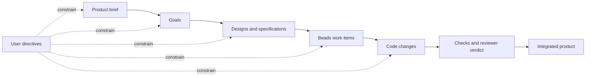

# Yoyodyne V1 Harness Design

## Status

This document records the agreed v1 design and the implementation sequence for reaching self-hosting early. Beads issue `yoyodyne-fmk` tracks completion of this design. Epic `yoyodyne-ifd` and its dependent milestone issues track implementation, which belongs in Beads rather than a Markdown task list.

## Summary

Yoyodyne is a local, single-operator harness that coordinates configurable AI agent roles to turn a product brief into goals, designs, implementation work, reviewed changes, and an integrated codebase. It aims to run development nearly autonomously: the human's routine interface is the product manager agent, and directing any other agent is an override rather than part of the loop. Claude Code is the default execution backend. Codex is a thinner optional backend for developer and reviewer agents. The managed project may be written in any language; Yoyodyne's own implementation language is not imposed on it.

V1 supports one product and one Git repository at a time. Its identifiers, configuration, and storage boundaries must allow later support for multiple products, repositories, and remote workers without changing the core domain model.

The implementation is deliberately sequenced around a narrow walking skeleton. Once Yoyodyne can take one Beads task, run one developer in an isolated worktree, execute deterministic checks, and preserve the result, that partial harness will be used to build later milestones. Automatic review and integration complete the self-hosting loop before the product-management hierarchy and concurrency are filled out.

## Goals

- Maintain a traceable chain from the product brief through goals, designs, work, code changes, and verification.
- Let configurable agent roles collaborate without allowing downstream agents to silently redefine upstream intent.
- Make user directives durable, discoverable, and enforceable regardless of which agent received them.
- Isolate implementation tasks in harness-managed Git worktrees and integrate successful work automatically.
- Use Beads as the durable workflow, dependency, blocker, directive, and handoff store.
- Use repository Markdown as the human-readable source of truth for the brief, goals, designs, and specifications.
- Support Claude Code as the default backend and Codex as an optional developer/reviewer backend.
- Reach a useful self-hosting threshold before implementing the entire v1 management hierarchy.
- Keep roles, policies, and provider selection configurable without making safety invariants optional.
- Run development nearly autonomously. The human's routine interface is the product manager: they state intent, approve the brief and goals, and answer questions the product manager escalates. Directing the architect, development manager, developer, or reviewer individually is available for inspection, recovery, and override, but is not part of the normal loop.
- Support development in any language. Yoyodyne is written in Go, but the projects it manages are not assumed to be: verification is whatever commands the project declares, and no language, build system, or test framework is built into the harness.

## Non-goals

- Multiple human users, permissions between users, or a hosted control plane.
- Remote agent execution in v1.
- Multiple active products or repositories in one v1 harness instance.
- Complete behavioral parity between Claude Code and Codex.
- Direct model API integration when the local coding-agent CLIs provide the required execution interface.
- A general-purpose chat application independent of software delivery.
- Replacing Git, Beads, or the coding agents' native tool execution.
- Native integration with any language's build system, test runner, or package manager. Language support means running the commands a project declares, not understanding its toolchain.
- Fully unattended operation. The human still approves the brief and goals and answers what the product manager escalates; autonomy is the absence of routine per-change gates, not the absence of a human.

## Design Invariants

1. Every design and implementation item must trace to at least one active goal; every active goal must support the product brief.
2. Upstream artifact ownership is enforced. Non-owners may propose changes, but cannot directly revise upstream intent.
3. A user directive applies regardless of which agent received it and remains discoverable until superseded or retired.
4. Ambiguous user intent pauses affected work until the product manager obtains clarification.
5. Artifact-changing directives pause affected work until the canonical artifacts and derived work are reconciled.
6. Developers only work in harness-created, validated worktrees; they never share a writable checkout.
7. Integration requires configured deterministic checks and an independent reviewer verdict. Routine human merge approval is not required.
8. Agent processes are ephemeral. Logical identities, decisions, assignments, sessions, and outcomes are durable.
9. The harness owns orchestration state transitions. Model output may recommend a transition but cannot bypass its preconditions.
10. All provider-specific behavior stays behind a capability-aware backend boundary.
11. The harness assumes no language, build system, or test framework in the managed project. Verification is the commands the project declares, run in the worktree; the harness decides only whether they passed.

## Product and Artifact Model

The canonical intent graph is:



Each canonical Markdown artifact has a stable ID and machine-readable metadata. The exact schema may evolve, but it must identify:

- artifact ID and type;
- owning role;
- lifecycle status;
- upstream artifacts it supports;
- revision or content hash used to derive downstream work;
- approval state when approval is configured.

The harness validates references and reports orphaned goals, designs, and work. It does not infer that an unlinked artifact is acceptable merely because its prose appears related.

### Artifact ownership

| Artifact or state | Owner | Other roles may |
|---|---|---|
| Product brief and goals | Product manager | Ask questions and propose amendments |
| Designs and specifications | Architect | Identify risks, ask questions, and propose amendments |
| Development plans and task decomposition | Development manager | Report dependencies, blockers, and side effects |
| Assigned code change | Developer | Modify code within the assigned worktree and task scope |
| Review verdict | Reviewer | Request repairs or approve against the design and checks |
| Workflow state, worktrees, checks, and integration | Harness | Agents may request actions but cannot bypass policy |

Ownership is an authorization boundary, not merely a prompt convention. A developer discovering a design problem creates a proposal or question for the architect; it does not edit the design and continue as if the change were approved.

## Agent Model

An agent definition separates four concerns:

- **Role:** responsibilities, authority, inputs, expected outputs, and escalation behavior.
- **Identity:** a stable logical instance with assignments and durable history.
- **Backend:** Claude Code or Codex execution mechanics.
- **Policy:** model selection, permissions, timeouts, retries, and resource limits.

The local Claude Code or Codex process is not the agent's durable identity. Each execution receives a context bundle reconstructed from canonical artifacts, active directives, the assigned Beads item, relevant decisions, and any resumable provider session. This bounds stale conversational memory and prepares the domain model for remote workers later.

### Default roles

#### Product manager

- Owns the product brief and goals.
- Conducts most interaction with the user through an interactive CLI chat.
- Ensures every goal supports the brief and is specific enough to design against.
- Records directives received by any agent and coordinates reconciliation.
- Requests clarification when intent is ambiguous; affected work remains paused.

#### Architect

- Translates goals into designs and specifications.
- Maintains traceability from each design to its supporting goals.
- Defines boundaries and compatibility expectations so parallel specifications can be implemented safely.
- Evaluates downstream discoveries and owns resulting design amendments.

#### Development manager

- Converts approved designs into Beads work with dependencies and acceptance criteria.
- Considers side effects and integration order.
- Assigns work to developers and manages retries, replanning, and reassignment.
- May fetch additional product or design detail rather than receiving the entire product history in every prompt.

#### Developer

- Receives a bounded work item, relevant design, directives, and manager guidance.
- Works only in the assigned worktree.
- Runs local checks and returns structured results, questions, and discovered risks.
- Proposes upstream changes instead of making them directly.

#### Reviewer

- Is independent of the developer execution that produced the change.
- Reviews the diff against the work item, design, directives, and configured checks.
- Returns a structured approve-or-repair verdict with actionable findings.
- Does not integrate the change directly.

The role list is configurable. The harness depends on declared capabilities and authority boundaries rather than hard-coded role names, although the defaults above define the supported v1 product workflow.

## User Interaction, Directives, and Approval

V1 provides an interactive CLI conversation with the product manager plus one-shot administrative commands for status, inspection, directives, and agent interaction. The conversation with the product manager is the intended routine interface: stating intent, approving the brief and goals, and answering escalated questions should be the whole of normal operation. The user may also address any other agent directly, but that is an inspection, recovery, and override path rather than part of the loop. A directive received by a lower-level agent is still globally enforceable within its scope.

A directive record contains at least:

- stable ID, text, author, timestamp, and scope;
- receiving agent and acknowledgement state;
- affected products, goals, designs, tasks, agents, or files when known;
- whether it changes canonical artifacts;
- reconciliation status and links to superseding directives.

Operational directives take effect immediately. A directive that changes the brief, a goal, or a design pauses affected downstream work, routes reconciliation to the owning role, marks derived items stale, and resumes only after the canonical chain is consistent. If the directive is ambiguous, the product manager asks the user and work remains paused.

By default, the human explicitly approves the initial brief and goals after discussing them with the product manager. Lower-level approval gates are configurable but disabled by default. This approval policy does not add a routine human merge gate: once a project enables automatic integration, verified and independently approved code is integrated without further human action, which is what makes near-autonomous operation possible.

The shipped bundle nevertheless defaults `approvals.integration` to `human`. That is deliberate and is not a retreat from the autonomy goal: a project opts in to automatic integration explicitly, and the harness then refuses that setting unless deterministic checks and an independent reviewer actually exist. Autonomy is something a project turns on once it has the gates to justify it, rather than something inherited silently by any repository that adds a configuration file.

## Persistence Boundaries

### Repository Markdown

Human-readable product intent lives with the product repository. A recommended initial layout is:

```text
docs/
  product/
    brief.md
    goals/
  designs/
  specifications/
.yoyodyne/
  config.yaml
  personas/
```

These files are reviewable with the code and are the source of truth for their content. Beads records their workflow state and relationships but does not replace them with issue descriptions.

Everything under `.yoyodyne/` is machine-independent and belongs in version control. A single `.yoyodyne.yaml` file at the repository root is still accepted so an existing project keeps working without being migrated; when both exist in one directory, the directory form wins.

### Beads

Beads is a required v1 dependency and the durable source of truth for:

- work items, status, dependencies, blockers, and assignments;
- directive records and reconciliation work;
- approval records and durable questions;
- links from work to canonical artifact IDs and revisions;
- retry, handoff, and discovered follow-up work.

The harness uses the `bd` CLI through a narrow adapter in v1. Domain code must not depend on raw command output outside that adapter, leaving room for a different Beads integration mechanism later.

### Runtime state

Provider event streams, process metadata, locks, caches, and temporary run state live outside the product repository under an operating-system-appropriate state directory. Durable outcomes are summarized into Beads. Worktrees also live outside the primary checkout by default. Secrets and provider credentials remain managed by the provider CLIs and are never copied into Beads or project Markdown.

All durable records include `ProductID` and, where applicable, `RepositoryID`, even though v1 configures exactly one of each.

## Backend Boundary

The harness uses coding-agent CLIs as subprocess backends. A conceptual Go interface is:

```go
type AgentBackend interface {
	CheckAvailability(ctx context.Context, cfg BackendConfig) error
	Capabilities(ctx context.Context, cfg BackendConfig) (Capabilities, error)
	Start(ctx context.Context, req RunRequest) (Run, error)
	Resume(ctx context.Context, req ResumeRequest) (Run, error)
}
```

`RunRequest` contains the role instructions, context bundle, repository and worktree identity, permission policy, desired structured result, and correlation IDs. A run emits normalized events such as:

- run and turn started;
- agent message;
- tool or command started/completed;
- file change observed;
- usage reported;
- run completed, failed, cancelled, or timed out.

The harness persists the provider session ID when available, but does not assume all backends support identical resumption, event, tool-control, or usage features. `Capabilities` makes those differences explicit.

### Claude Code

Claude Code is the default backend for every v1 role. The adapter uses its non-interactive, structured-output mode and existing local authentication. The first walking skeleton only needs the developer path; manager and product-role prompting is added later.

### Codex

Codex is a thin optional v1 backend for developer and reviewer roles. Its adapter uses `codex exec`, JSONL events, resumable sessions when available, structured final output where useful, and explicit sandbox settings. Codex is not required to match every Claude Code feature. Unsupported role/backend or policy combinations fail validation before work is assigned.

Codex authentication is delegated to the locally installed CLI. It may use ChatGPT subscription authentication or an API key; the harness reports the active/missing state but never manages account credentials.

## Configuration

Agent definitions and behavior are configurable, while invariants remain enforced in code. The executable ships a versioned, read-only bundle of agent definitions and personas, so a project records only what is genuinely its own and never needs access to the Yoyodyne source checkout. A project inherits the bundle by name and overlays what it changes:

```yaml
version: 1
extends: builtin:v1

product:
  id: yoyodyne
  repository: .

approvals:
  integration: automatic

checks:
  - go test ./...
  - go vet ./...

agents:
  developer:
    model: claude-opus-5-20260514
  reviewer:
    persona:
      version: house-1
      path: personas/reviewer.md
```

That is a complete configuration. The five default agents — product manager, architect, development manager, developer, and reviewer — come from `builtin:v1` with a role, a backend, a model selector, an instance count, and a versioned persona each. Three layers produce the effective configuration, later ones winning: harness defaults, the named bundle, then the project file. A field a layer does not mention is inherited; a field it does mention replaces the inherited value, except that `checks` is replaced as a whole list rather than concatenated, and a `persona` override replaces the inherited persona completely rather than merging into it. Removing an inherited agent is explicit, so an agent is never lost by being accidentally omitted.

The `checks` above are this project's own, and they are the harness's only view of the managed project's toolchain. Each entry is a shell command run in the worktree; the harness decides whether it passed and nothing else. A TypeScript, Python, or Java project declares its own commands in exactly the same place, which is what keeps the harness language-agnostic without needing per-language support.

`version` is the one field a project never inherits: it must be declared even when `extends` names a bundle that declares its own, so a file written against a different schema fails rather than loading as whatever the bundle happened to say. A configuration with no `extends` key is a complete standalone file that inherits only the harness defaults; that is the pre-directory shape, and it still loads unchanged.

Personas specialize how an agent works and can never grant it authority: the immutable role contracts are enforced in Go and prefix the configured guidance in the prompt. A persona `path` is relative to the project `.yoyodyne` directory and must name a Markdown file inside it. Configuration loading rejects unknown keys, unknown bundles, unsafe or non-Markdown persona paths, unknown role capabilities, invalid ownership, unsupported provider combinations, and automatic integration without both checks and review. Validation runs against the effective configuration, so a combination no single layer expressed still fails before any work is claimed.

[Configuration](configuration.md) is the operator-facing reference for the layout, precedence, merge semantics, and inspection commands.

## Work Execution and Integration

For each ready development item, the harness:

1. Validates that its design and goal references are current and that no applicable directive is unresolved.
2. Reserves the item and creates a uniquely named branch and worktree outside the primary checkout.
3. Builds the developer's bounded context and starts the selected backend.
4. Streams normalized events and persists enough state to diagnose or recover an interrupted run.
5. Runs configured deterministic checks in the worktree.
6. Runs an independent reviewer with the work item, design, directives, diff, and check results.
7. On repair, returns findings to the same developer for up to two attempts by default.
8. After the retry limit, returns control to the development manager to replan or reassign.
9. On success, revalidates the target branch, integrates automatically, records the outcome, and cleans up the worktree.

The harness performs Git lifecycle operations directly; agents do not create, assign, merge, or remove their own worktrees. Before any cleanup, the harness resolves and validates the exact recorded path and refuses broad or unresolved targets.

If integration encounters drift or conflicts, the change is not force-merged. The development manager receives a new reconciliation decision with the current target state. Failed or interrupted worktrees remain discoverable until safely resumed or explicitly retired.

## Recovery and Idempotency

Every orchestration transition has a durable correlation ID and is safe to reconcile after restart. At startup the harness compares:

- Beads assignment and workflow state;
- recorded run/process state;
- existing worktrees and branches;
- provider session state where queryable;
- check, review, and integration outcomes.

It then resumes an eligible run, marks an external process outcome, or raises a durable blocker. It never starts a second developer for an item merely because the original process handle was lost.

## CLI Surface

The exact command names may change, but v1 needs these operator capabilities:

```text
yoyo init                 validate repository, Beads, Git, and providers
yoyo chat                 talk with the product manager
yoyo run <beads-id>       execute or resume a specific ready item
yoyo work                 schedule ready development work
yoyo status               show agents, runs, blockers, and stale artifacts
yoyo directive ...        record and inspect durable user directives
yoyo agent ...            inspect or address a specific logical agent
yoyo doctor               diagnose configuration and recovery state
```

These are not peers. `yoyo chat` is the primary interface; `work` schedules what the harness selects on its own. `run <beads-id>` executes one explicitly named item and is an administrative and recovery entry point, not the normal way to drive development — the Milestone 0 harness exposes it as the only verb because the management hierarchy does not exist yet, which is a bootstrap condition rather than the intended user experience.

Commands support machine-readable output so later orchestration, tests, and remote execution do not depend on terminal rendering.

## Self-hosting Sequence

Self-hosting is a sequencing constraint, not a claim that an incomplete harness can safely govern itself without observation. Bootstrap work should establish one end-to-end path and then immediately use it in progressively more authoritative modes.

### Milestone 0: Bootstrap the walking skeleton manually

Implement only what is required for one bounded developer run:

- Go module, CLI entry point, configuration loading, and structured logging;
- Beads adapter for reading, claiming, updating, and blocking one item;
- Git/worktree manager with strict path validation;
- process runner and normalized event envelope;
- Claude Code developer backend;
- context assembly from a Beads item plus referenced repository Markdown;
- configured deterministic checks;
- run summary and recoverable local state.

**First self-use threshold:** Yoyodyne can take one of its own Beads implementation items, create an isolated worktree, ask Claude Code to implement it, run checks, and preserve the branch, diff, event log, and outcome. During this short bootstrap stage, integration happens outside the incomplete harness because independent review and automatic integration do not exist yet. This is temporary bootstrap operation, not a v1 human approval policy.

### Milestone 1: Close the self-hosting loop

Use the walking skeleton to add:

- independent reviewer execution and structured verdicts;
- two-attempt developer repair loop;
- automatic conflict-aware integration and safe worktree cleanup;
- restart reconciliation and duplicate-run prevention;
- end-to-end tests with fake backends and temporary Git repositories.

**Closed-loop self-hosting threshold:** Yoyodyne can implement, verify, review, repair, and integrate its own bounded Beads work without routine human approval. From this point, all suitable later milestones should be developed through the harness, with the operator observing status and intervening only for ambiguity or genuine blockers.

### Milestone 2: Add artifact governance

Use the closed loop to add stable artifact IDs, relationship validation, role ownership, change proposals, staleness propagation, directive reconciliation, and configurable approvals. Seed Yoyodyne's own brief, goals, and designs as the first governed product artifacts.

### Milestone 3: Add the management hierarchy and primary UX

Add the product-manager chat, architect, development manager, configurable role definitions, durable logical identities, targeted agent interaction, and one-shot administrative commands. The development manager begins producing and assigning the Beads work that the already-running execution loop consumes.

### Milestone 4: Add scheduling and concurrency

Add the ready-work scheduler, configurable concurrency, multiple isolated developer worktrees, integration ordering, and cross-task conflict handling. Concurrency defaults to one even after support is present.

### Milestone 5: Add thin Codex support

Add the Codex developer/reviewer adapter, capability validation, event normalization, authentication diagnostics, session resumption, and backend conformance tests. Agent configuration may then select Codex for developer or reviewer instances.

This sequence keeps the first bootstrap small, exercises real subprocess and Git boundaries early, and ensures the harness—not a parallel ad hoc workflow—builds most of v1.

## Testing Strategy

- Unit-test policy, graph validation, state transitions, retry decisions, and path safety without invoking a model.
- Use fake backends that replay success, failure, timeout, malformed events, repair verdicts, and interrupted sessions.
- Use temporary Git repositories to test branch/worktree creation, drift, conflicts, integration, cleanup, and restart reconciliation.
- Keep a small opt-in conformance suite for installed Claude Code and Codex CLIs.
- Add a self-hosting smoke test that executes a harmless change in a disposable copy or fixture repository.
- Cover a fixture project that is not Go, so the language-agnostic claim is verified rather than assumed. Since the harness's only contact with a toolchain is running declared commands and reading exit codes, this needs a fixture whose checks are not Go commands, not a second language integration.
- Treat model quality as nondeterministic; assert protocol and state invariants rather than exact prose.

## Security and Safety

- Default each backend to the least filesystem and command permissions compatible with its role.
- Keep credentials in provider-managed stores and redact environment values and event payloads before persistence.
- Validate repository and worktree paths before every mutating Git or filesystem action.
- Never allow an agent response to select an arbitrary cleanup path or bypass checks, review, or directive reconciliation.
- Record the commands and result summaries used for deterministic verification.
- Require explicit configuration for commands or paths outside the product repository and managed worktree roots.

## Implementation Choices to Settle

These choices do not block the v1 architecture and should be decided in the milestone that first needs them:

- the exact Markdown metadata schema and lifecycle vocabulary for brief, goal, design, and specification artifacts;
- the Beads issue types, labels, and link fields used to encode directives, approvals, artifact revisions, and provider sessions;
- whether conflict-free integration uses fast-forward, rebase, or merge commits by default;
- the local runtime-state format and operating-system-specific root directories;
- context-size limits and selection rules for each role;
- the normalized event schema version and which provider events are retained versus summarized.

Each decision should be captured in the owning design artifact and linked from the Beads implementation item. None may weaken the design invariants.

## Deferred Beyond V1

- Remote workers and transport protocols.
- Multiple simultaneously active products and repositories.
- Cross-host worktree and lease management.
- Provider API backends and non-CLI model integrations.
- Rich graphical interfaces.
- Organization-level policy, audit, and multi-user access controls.

## References

- [Gas Town](https://yegge.ai/gastown)
- [Beads synchronization concepts](https://github.com/gastownhall/beads/blob/main/docs/SYNC_CONCEPTS.md)
- [Claude Code headless mode](https://code.claude.com/docs/en/headless)
- [Codex non-interactive mode](https://learn.chatgpt.com/docs/non-interactive-mode)
- [Codex authentication](https://learn.chatgpt.com/docs/auth)
